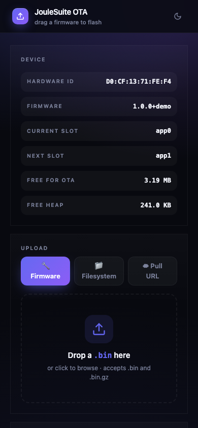

# JouleOTA

> Async over-the-air firmware updater for ESP32 and ESP8266 — drag-drop in
> a browser, pull from a URL, sign with HMAC-SHA256, A/B-rollback if the
> new image goes bad. MIT-licensed, mobile-friendly, gzipped UI.


**Author:** [Chinmoy Bhuyan](mailto:dikibhuyan@gmail.com) · **License:** MIT
· **Targets:** ESP32 (S2 / S3 / C3 / classic), ESP8266

Two features are ESP32-only, because the hardware is: **pull-from-URL**
(`/ota/pull` answers `501` on ESP8266) and **A/B rollback** (ESP8266 has no
second app slot). Push upload, signing, auth, rate limiting and the UI work
on both.

---

## Features

| | |
|---|---|
| 🖱  **Drag-drop UI** | Polished single-page updater with SVG progress ring, live byte/throughput counters, mode tabs |
| ☁  **Pull from URL** (ESP32) | Tell the device to fetch a firmware from any HTTP/HTTPS URL, redirects followed — perfect for fleet rollouts from a build pipeline |
| 🔐 **Signed firmware (optional)** | HMAC-SHA256 over the uploaded image, hashed incrementally as it streams, constant-time compare. Disabled by default; enable with one call |
| ↺  **A/B rollback** (ESP32) | If the new firmware never calls `commit()` within your timeout, the bootloader picks the previous slot on the next reset |
| 📁 **Firmware + filesystem** | Switch modes from the same UI to flash either the app partition or SPIFFS / LittleFS |
| 📡 **Live progress via SSE** | Every connected browser tab updates in real-time, not just the one that started the upload |
| ⏱  **Rate limiting** | Per-IP minimum gap (default 5 s) so a brute-force auth attempt can't burn the flash erase cycle counter |
| 🪪 **HW ID + version** | Free-form identity strings exposed on the page and in `/ota/info` JSON |
| 🔒 **HTTP Basic + token auth** | Pick `OtaAuth::Basic` for browser flows, `OtaAuth::Token` for headless CI |
| 🎨 **Theme aware** | Dark / light / auto; user choice persists; brand colour configurable |
| 📱 **Mobile-first** | 44 px touch targets, viewport-fit safe-area, glass-morphism panels |
| 🪶 **Pre-gzipped UI** | 70 KB SPA ships as a 25 KB flash blob and goes out with `Content-Encoding: gzip` |

---

## Quick start

```cpp
#include <WiFi.h>
#include <ESPAsyncWebServer.h>
#include <JouleOTA.h>

AsyncWebServer server(80);

void setup() {
  Serial.begin(115200);
  WiFi.mode(WIFI_STA);
  WiFi.begin("YOUR_SSID", "YOUR_PASS");
  while (WiFi.status() != WL_CONNECTED) delay(250);

  JouleOTA.setID(WiFi.macAddress());
  JouleOTA.setFWVersion("1.0.0");
  JouleOTA.begin(&server, "admin", "joule");
  server.begin();

  JouleOTA.commit();           // mark this firmware as known-good
}

void loop() { JouleOTA.loop(); }
```

Open `http://<device-ip>/ota` and drop a `firmware.bin`. Done.

---

## API reference

### Lifecycle

```cpp
void begin(AsyncWebServer *server,
           const String &username = "",
           const String &password = "");
void loop();          // call from loop() for pull-mode polling + rollback timing
```

`begin()` mounts every endpoint described in the table below. If
`username` is non-empty the library defaults to HTTP Basic auth using
those credentials; pass `""` to disable auth.

### Identity & branding

```cpp
void setID         (const String &id);          // shown in UI + /ota/info
void setFWVersion  (const String &ver);
void setTitle      (const String &title);       // page title
void setBrandColor (const String &cssColor);    // accent colour
```

### Authentication

```cpp
enum class OtaAuth { None, Basic, Token };

void setAuth(OtaAuth mode, const String &userOrToken, const String &password = "");
void clearAuth();
```

* `OtaAuth::Basic` → standard browser-prompted Basic auth.
* `OtaAuth::Token` → expects header `X-Joule-Token: <token>` on every
  request. Use this for CI flows where you don't want a browser dialog.

### Signed firmware (recommended for production)

```cpp
void setSigningKey(const String &hexKey);       // empty = disable (default)
```

If a key is set, each `/ota/upload` must include header
`X-Joule-Signature: <hex>` where `hex` is the HMAC-SHA256 of the image
computed with the key. The digest is fed to the HMAC chunk by chunk as the
body streams in (nothing is buffered) and compared — constant-time, against
the decoded bytes so case doesn't matter — before `Update.end()` marks the
new slot bootable. A missing, malformed or wrong signature aborts the
updater and answers `400`; the check never fails open. Recommended key
length: 32 bytes (64 hex chars).

This covers push uploads only. A pulled image carries no signature — pin a
CA for it with `setPullCACert()` instead.

### Policy

```cpp
void setRateLimitMs       (uint32_t ms);   // min gap per IP: upload, pull, rollback
void allowFirmwareUpdates  (bool on);      // default true
void allowFilesystemUpdates(bool on);      // default true
void allowPullMode         (bool on);      // default true

void setPullCACert     (const char *pemRootCa);  // pin the TLS root for /ota/pull
void allowInsecurePullTls(bool on);              // default false — see below
```

`https://` pull URLs are **refused** unless you either pin a root CA or
explicitly opt into `allowInsecurePullTls(true)`. `WiFiClientSecure`
verifies nothing until it is told what to trust, so an unpinned pull would
flash whatever answers the DNS query. The PEM string is not copied — pass a
literal or something else that outlives the device.

### Rollback

```cpp
void setRollbackTimeoutMs(uint32_t ms);   // 0 = disabled (default)
void commit();                            // call from setup() after self-test
void rollback();                          // revert to the previous slot + reboot
```

The watchdog only arms when the bootloader is actually waiting on a verdict
for the running image (`slotState: "pending"` in `/ota/info`). A
serially-flashed build, a single-app partition table and every ESP8266 are
left alone, so a failing self-test can't turn into a reset loop.
`rollback()` on a device with no other valid slot emits a
`rollback-unavailable` status event and does nothing; `POST /ota/rollback`
checks the same condition up front and answers `409` (or `501` on ESP8266)
instead of `200`. Call order doesn't matter — `setRollbackTimeoutMs()` works
before or after `begin()`.

Recommended flow:

```cpp
void setup() {
  …
  JouleOTA.setRollbackTimeoutMs(30000);   // 30 s grace period
  JouleOTA.begin(&server, "admin", "pass");

  if (runSelfTest()) JouleOTA.commit();
  // else: do nothing → bootloader will revert on next reset
}
```

### Callbacks

```cpp
using OtaStartCb     = std::function<void(OtaMode mode)>;
using OtaProgressCb  = std::function<void(size_t current, size_t total)>;
using OtaEndCb       = std::function<void(bool success, const String &msg)>;
using OtaErrorCb     = std::function<void(const String &reason)>;
using OtaRebootCb    = std::function<bool()>;   // return false to suppress reboot

void onStart       (OtaStartCb     cb);
void onProgress    (OtaProgressCb  cb);
void onEnd         (OtaEndCb       cb);
void onError       (OtaErrorCb     cb);
void onBeforeReboot(OtaRebootCb    cb);
```

Use `onBeforeReboot` to do a graceful shutdown (close TLS sockets, write
state to NVS, …) before the device restarts after a successful flash.

### Status accessors

```cpp
bool    isUpdating()    const;
size_t  bytesWritten()  const;
size_t  totalBytes()    const;
uint8_t progressPct()   const;
```

---

## HTTP endpoints

| Path | Method | Auth | Description |
|---|---|---|---|
| `/ota`        | GET  | yes | The drag-drop SPA |
| `/ota/info`   | GET  | yes | JSON snapshot of device + partition state |
| `/ota/upload` | POST | yes | Multipart firmware/filesystem upload (`?mode=firmware\|filesystem`) |
| `/ota/pull`   | POST | yes | `{"url":"…","mode":"firmware"}` — device fetches over HTTP/HTTPS (ESP32 only; `501` elsewhere) |
| `/ota/events` | SSE  | yes | Live progress + status events. Basic auth only — an `EventSource` can't send `X-Joule-Token`, so token mode closes this endpoint rather than leaving it open |
| `/ota/commit` | POST | yes | Mark current slot valid (cancels pending rollback) |
| `/ota/rollback` | POST | yes | Revert to previous slot and reboot. `409 rollback-unavailable` when there is no other valid slot (serial-flashed image, single-app partition table); `501` on ESP8266 |

### `/ota/info` payload

```json
{
  "hwId":        "D0:CF:13:73:0A:B8",
  "fwVersion":   "1.0.0+demo",
  "title":       "JouleSuite OTA",
  "freeHeap":    250248,
  "currentSlot": "app0",
  "nextSlot":    "app1",
  "freeOta":     3342336,
  "slotState":   "valid",
  "updating":    false,
  "allowFw":     true,
  "allowFs":     true,
  "allowPull":   true
}
```

### `/ota/events` event stream

```
event: progress
data: {"written":131072,"total":1115632,"mode":"firmware"}

event: status
data: complete
```

`progress` fires every ~32 KB; `status` fires for lifecycle transitions
(`start:firmware`, `complete`, `rate-limited`, `pull-http-404`, …).

---

## Pull-from-URL flow

```bash
curl -u admin:joule -X POST http://device.local/ota/pull \
  -H "Content-Type: application/json" \
  -d '{"url":"https://builds.example.com/v1.2.3/firmware.bin","mode":"firmware"}'
```

The device queues the URL and answers `202 Accepted` immediately, then
downloads on the next `loop()` tick, flashes and reboots. Other answers:
`409` a pull or upload is already in flight, `429` rate-limited, `413`
body over 512 bytes, `400` unparseable or no `url`, `501` on ESP8266.

The download itself is synchronous inside `loop()` — a 1 MB image blocks
your sketch for the length of the transfer. Redirects are followed
(`HTTPC_STRICT_FOLLOW_REDIRECTS`), so release assets and pre-signed
object-store URLs work. A stalled server ends the transfer after 10 s of
silence and the whole download is capped at 5 minutes; either way the image
is abandoned, never flashed part-way.

**The response must carry a `Content-Length`.** A chunked or length-less
response is refused with a `pull-no-length` status event: without a declared
size there is no way to tell a finished body from a stalled one, and a pull
has no signature to catch a truncated image the way `/ota/upload` does.

HTTPS needs a trust decision from you:

```cpp
JouleOTA.setPullCACert(ISRG_ROOT_X1_PEM);   // pin, or …
JouleOTA.allowInsecurePullTls(true);        // … explicitly accept any cert
```

With neither set, `https://` URLs are refused with a `pull-tls-unpinned`
status event. Certificate *fingerprint* pinning is not supported — ESP32's
`WiFiClientSecure` has no fingerprint API.

---

## Signed-firmware workflow

1. Generate a 32-byte key once and store it in your build secrets:

   ```bash
   openssl rand -hex 32   # 64-char hex
   ```

2. In firmware:

   ```cpp
   JouleOTA.setSigningKey("a9f1…");      // the hex string
   ```

3. In your CI, sign each release before upload:

   ```bash
   SIG=$(openssl dgst -sha256 -mac HMAC -macopt hexkey:a9f1… -hex firmware.bin | awk '{print $2}')
   curl -u admin:joule -X POST http://device/ota/upload?mode=firmware \
        -H "X-Joule-Signature: $SIG" \
        -F update=@firmware.bin
   ```

Unsigned uploads — and uploads with a wrong signature — are rejected with
`400 Bad Request`, and the updater is aborted so nothing is left half-written.
The browser UI does not compute signatures, so turning signing on makes
`/ota/upload` a CI-only endpoint.

---

## Rollback explained

ESP32's bootloader supports **two app slots**: `app0` and `app1`. JouleOTA
writes the new image into whichever slot is *not* running, then flags the
new slot as `PENDING_VERIFY`. On the next reset the bootloader runs the
new firmware once. If your sketch calls `JouleOTA.commit()` before the
rollback timeout expires, the slot is marked `VALID` and stays the active
slot. If it doesn't (because the firmware crashed, hung, or failed
self-test) the bootloader picks the previous `VALID` slot on the next
reset and you're back to a known-good state.

```cpp
void setup() {
  // … bring up Wi-Fi …
  JouleOTA.setRollbackTimeoutMs(30000);   // 30 s grace
  JouleOTA.begin(&server, "admin", "pw");

  // run smoke-tests: peripherals reachable, NTP synced, etc.
  if (smokeTestPasses()) {
    JouleOTA.commit();
  } else {
    JouleSerial.err("self-test failed — letting bootloader roll back");
  }
}
```

For a manual rollback (e.g. operator-triggered from the UI):

```cpp
JouleOTA.rollback();   // marks current invalid + reboots
```

---

## Authentication patterns

### Browser → HTTP Basic

```cpp
JouleOTA.begin(&server, "admin", "strong-password");
```

The browser prompts on first visit; credentials stick for the session.

### CI / scripts → token header

```cpp
JouleOTA.setAuth(joule::OtaAuth::Token, "long-random-token");
```

```bash
curl -X POST http://device/ota/upload?mode=firmware \
     -H "X-Joule-Token: long-random-token" \
     -F update=@firmware.bin
```

### Local-only / behind VPN → no auth

```cpp
JouleOTA.begin(&server);              // pass empty strings
```

---

## UI walkthrough

| Section | What you see |
|---|---|
| **Header** | Device title + theme toggle (◐) |
| **Device card** | HWID, FW version, current slot (`app0`/`app1`), next slot, free OTA bytes, free heap |
| **Mode tabs** | 🔧 Firmware · 📁 Filesystem · ☁ Pull URL |
| **Drop zone** | Drag a `.bin` (or `.bin.gz`) anywhere on the card, or click to browse |
| **Progress ring** | SVG arc fills with a brand-gradient as bytes upload; live %/MB/throughput |
| **Log pane** | Per-event log: file name + size, percent ticks, status messages, errors |
| **Pull-URL tab** | URL input + "Pull & flash" button (queues a fetch on the device) |
| **Maintenance card** | ✓ Commit current · ↺ Rollback (red, confirmation prompt) |

Mobile (390 px wide):



---

## Troubleshooting

| Symptom | Cause | Fix |
|---|---|---|
| `400 Bad Request` on upload | Signed-firmware mode is on but signature header missing/wrong | Set the header or temporarily clear the key |
| `429` + `rate-limited` status event | Too many upload/pull/rollback attempts from the same IP in the last 5 s | `setRateLimitMs(0)` or wait |
| `begin-failed:...esp_partition_find_first` | OTA partition layout missing | Use a `default_8MB.csv` (or larger) partition CSV |
| Upload completes, device reboots, then reverts once | Self-test isn't calling `commit()` after success | Add `JouleOTA.commit()` at the end of `setup()` |
| `pull-tls-unpinned` status event | `https://` pull URL with no CA pinned | `setPullCACert()`, or `allowInsecurePullTls(true)` if you accept the risk |
| Upload answers `409 busy` | A previous upload or pull is still running | Wait, or check `/ota/info` → `updating` |
| UI loads but progress stays at 0% | The browser tab uploading is fine; this tab is observing via SSE and the device is busy | Just wait — progress will sync up |
| `IncompleteRead` on weak Wi-Fi | TCP retransmits failing | JouleOTA does not touch the radio. Add `WiFi.setSleep(false)` and `WiFi.setTxPower(WIFI_POWER_19_5dBm)` in your sketch, move the device closer, or use a directional antenna |

---

## Comparison with build-it-yourself

| Concern | Roll-your-own | JouleOTA |
|---|---|---|
| Drag-drop UI | Write & maintain HTML | Included, 25 KB gz |
| Pull-from-URL | Bespoke HTTP client + state machine | One POST `/ota/pull` |
| Signature check | Hook into mbedtls manually | `setSigningKey()` |
| A/B rollback | Read `esp_ota_*` APIs by hand | `setRollbackTimeoutMs()` + `commit()` |
| Rate limiting | Add yourself | Built-in per-IP table |
| Live multi-client progress | Build an SSE channel | Included on `/ota/events` |
| Theme + branding | Custom CSS | `setTitle()`, `setBrandColor()` |

---

## Dependencies

* `ESP32Async/ESPAsyncWebServer @ ^3.11.0` — the floor is set by
  `AsyncURIMatcher::exact()`, which is a web-server API, not a core one.
  Anything older fails to compile with `'AsyncURIMatcher' has not been declared`.
* `ESP32Async/AsyncTCP @ ^3.4.0`
* `bblanchon/ArduinoJson @ ^7.4.0`
* arduino-esp32 core 2.0.17 or newer (the bundled demo builds on 2.0.17)

---

## License

MIT — see [LICENSE](LICENSE).

---

<sub>**Author:** Chinmoy Bhuyan · **Email:** dikibhuyan@gmail.com · **(c)** 2026 — MIT</sub>
